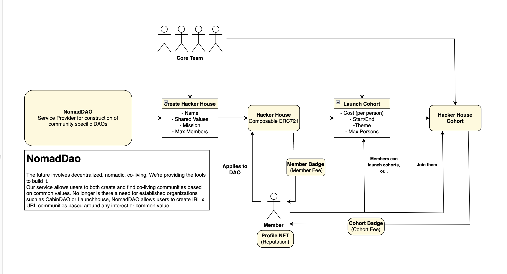
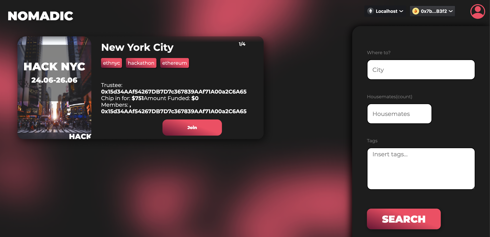
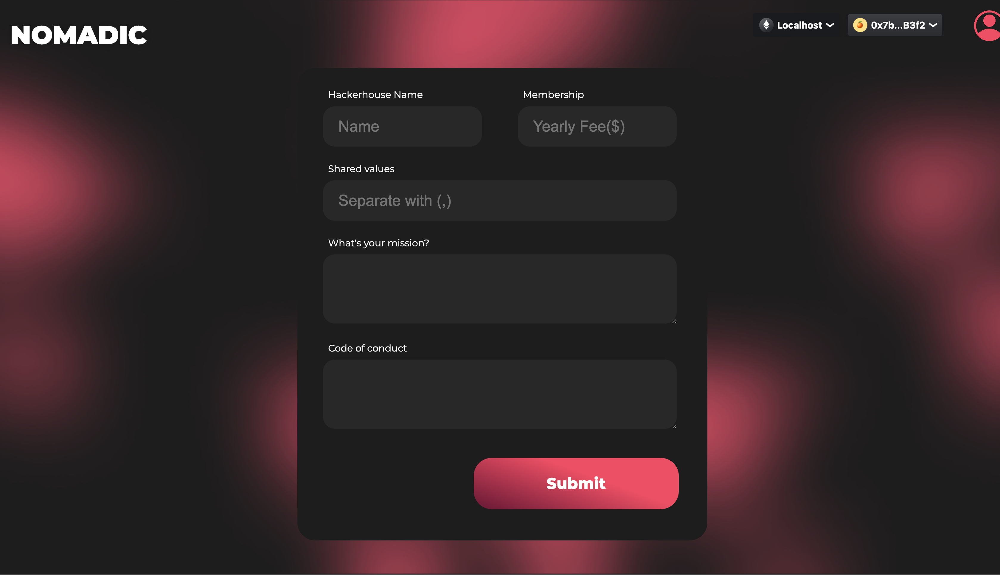
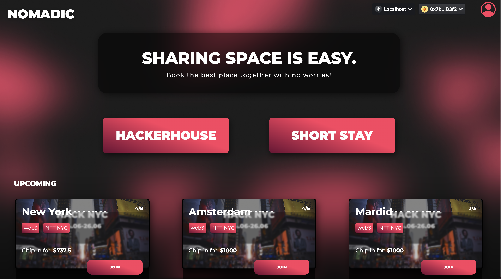
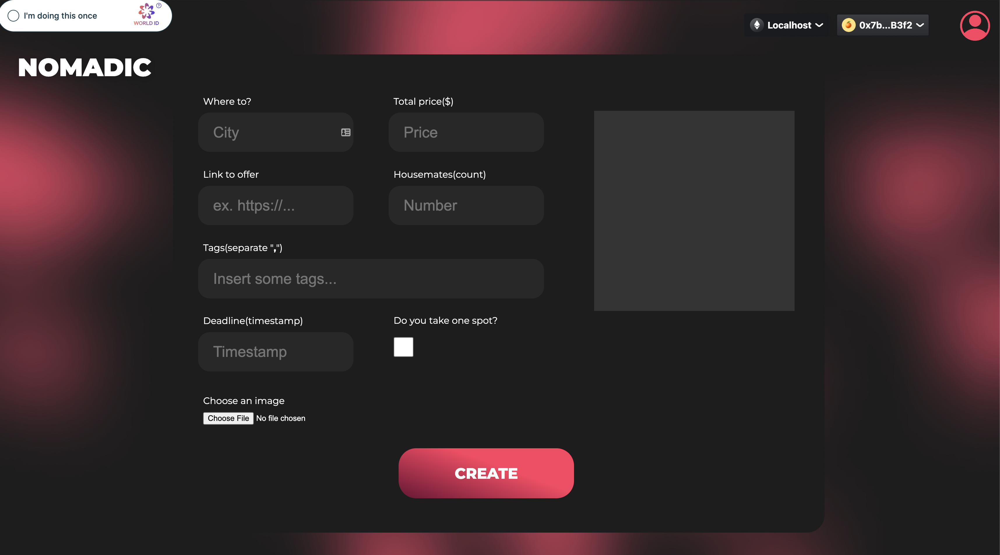
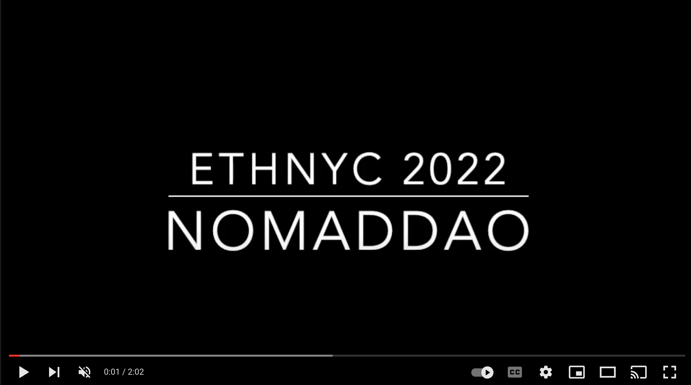
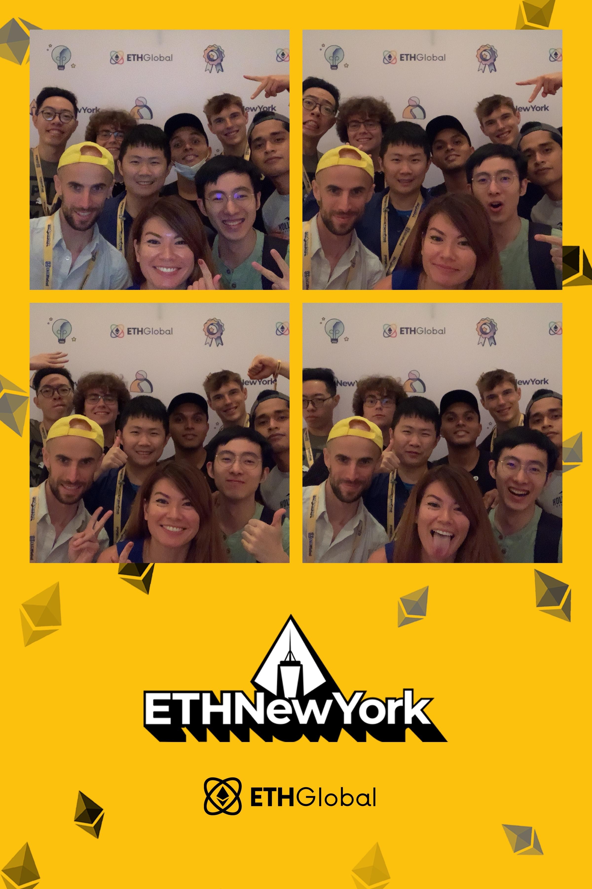

# NomadDAO

NomadDAO is a decentralized platfoform bringing web3 community together. It makes co-living arrangement process easy, trustless and newcommers friendly.

## Project Description
NomadDAO has 2 primary features: creating/finding a short stay and creating/finding a hacker house. We store prove of previous interactions with our platform(communities user belongs to, previous short stays) using on-chain reputation stored in a soulbound NFT. Smart contract is designed to facilitate chipping in for a stay and also a community governance to allow voting decisions within the hacker house. We want to make our platform as secure as possible and for this reason we are using the proof of personhood powered by WorldCoin's identity tech. We used Skale Network to facilitate chipping for a stay, as well as the equal refund of money if something goes wrong with the booking process. The community protocol allows hacker house members to vote on core team ideas.

## How it's Made
Our project uses WalletConnect which makes connecting to our app convenient for our users thanks to QR code pop-up. We wanted to make sure that users who are booking an apartment us or join a hacker house with us are real, and so we used WorldCoin' proof of personhood tech to solve this problem. For deployment we decided to use Polygon and Scale. For storing our updatable NFT metadata we used IPFS.

# ETHNYC 2022 Submission
https://ethglobal.com/showcase/nomad-dao-8gesk

### Architecture

### Screenshots and Demo

# Prizes:

## Worldcoin 

🥈 2nd place $5,000

## IPFS

🥈 2nd place $3,000

## Covalent

:swimmer: Pool Prize $500

# Team 
(5 team memebers + friends)

Carlos Ramos

*Full-stack Developer*

Piotr Gerke

*Front-end Developer*

Kiernan Geoghegan

*Business Analyst & Research*

Konrad Gnat

*Full-stack Developer*

Kok Chung Ong

*Marketing & Design*

### to run front end locally

clone

`git clone https://github.com/jrcarlos2000/ETH-NYC`

install dependencies

`cd ./ETH-NYC/frontend`

`npm i`

run front end locally

`npm run start`

